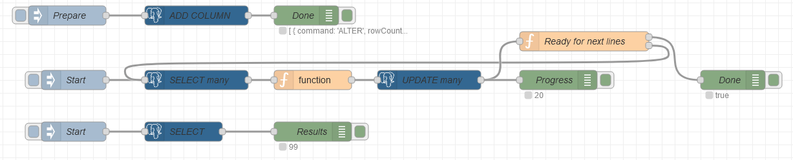

# node-red-contrib-postgresql

[node-red-contrib-postgresql](https://github.com/alexandrainst/node-red-contrib-postgresql)
is a [**Node-RED**](https://nodered.org/) node to query a [**PostgreSQL**](https://www.postgresql.org/) 🐘 database.

It supports *splitting* the resultset and *backpressure* (flow control), to allow working with large datasets.

It supports *parameterized queries*.

## Outputs

The response (rows) is provided in `msg.payload` as an array.

An exception is if the *Split results* option is enabled and the *Number of rows per message* is set to **1**,
then `msg.payload` is not an array but the single-row response.

Additional information is provided as `msg.pgsql.rowCount` and `msg.pgsql.command`.
See the [underlying documentation](https://node-postgres.com/api/result) for details.

In the case of multiple queries, then `msg.pgsql` is an array.

## Inputs

### SQL query template

This node uses the [Mustache template system](https://github.com/janl/mustache.js) to generate queries based on the message:

```sql
-- INTEGER id column
SELECT * FROM table WHERE id = {{{ msg.id }}};

-- TEXT id column
SELECT * FROM table WHERE id = '{{{ msg.id }}}';
```

### Parameterized query

Parameters for parameterized queries can be passed as a parameter array `params` of the `msg` object:

```js
// In a function, provide parameters for the parameterized query
msg.params = [ msg.id ];
```

```sql
-- In this node, use a parameterized query
SELECT * FROM table WHERE id = $1;
```

## Installation

### Using the Node-RED Editor

You can install [**node-red-contrib-postgresql**](https://flows.nodered.org/node/node-red-contrib-postgresql) directly using the editor:
Select *Manage Palette* from the menu (top right), and then select the *Install* tab in the palette.

### Using npm

You can alternatively install the [npm-packaged node](https://www.npmjs.com/package/node-red-contrib-postgresql):

* Locally within your user data directory (by default, `$HOME/.node-red`):

```sh
cd $HOME/.node-red
npm i node-red-contrib-postgresql
```

* or globally alongside Node-RED:

```sh
npm i -g node-red-contrib-postgresql
```

You will then need to restart Node-RED.

## Backpressure

This node supports *backpressure* / *flow control*:
when the *Split results* option is enabled, it waits for a *tick* before releasing the next batch of lines,
to make sure the rest of your Node-RED flow is ready to process more data
(instead of risking an out-of-memory condition), and also conveys this information upstream.

So when the *Split results* option is enabled, this node will only output one message at first,
and then awaits a message containing a truthy `msg.tick` before releasing the next message.

To make this behaviour potentially automatic (avoiding manual wires), this node declares its ability by exposing a truthy `node.tickConsumer`
for downstream nodes to detect this feature, and a truthy `node.tickProvider` for upstream nodes.
Likewise, this node detects upstream nodes using the same back-pressure convention, and automatically sends ticks.

### Example of flow

Example adding a new column in a table, then streaming (split) many lines from that table, batch-updating several lines at a time,
then getting a sample consisting of a few lines:

Example: [flow.json](doc/flow.json)



The *debug* nodes illustrate some relevant information to look at.

## Sequences for split results

When the *Split results* option is enabled (streaming), the messages contain some information following the
conventions for [*messages sequences*](https://nodered.org/docs/user-guide/messages#message-sequences).

```js
{
  payload: '...',
    parts: {
      id: 0.1234, // sequence ID, randomly generated (changes for every sequence)
      index: 5, // incremented for each message of the same sequence
      count: 6, // total number of message; only available in the last message of a sequence
      parts: {}, // optional upstream parts information
    },
    complete: true, // True only for the last message of a sequence
}
```

## Credits

Major rewrite in July 2021 by [Alexandre Alapetite](https://alexandra.dk/alexandre.alapetite) ([Alexandra Institute](https://alexandra.dk)),
of parents forks:
[andreabat](https://github.com/andreabat/node-red-contrib-postgrestor) /
[ymedlop](https://github.com/doing-things-with-node-red/node-red-contrib-postgrestor) /
[HySoaKa](https://github.com/HySoaKa/node-red-contrib-postgrestor),
with inspiration from [node-red-contrib-re-postgres](https://flows.nodered.org/node/node-red-contrib-re-postgres)
([code](https://github.com/elmagopy/node-red-contrib-re2-postgres)).

This node builds uppon the [node-postgres](https://github.com/brianc/node-postgres) (`pg`) library.

Contributions and collaboration welcome.
